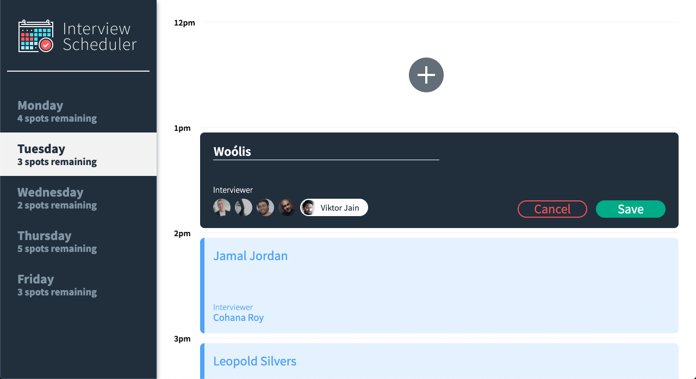
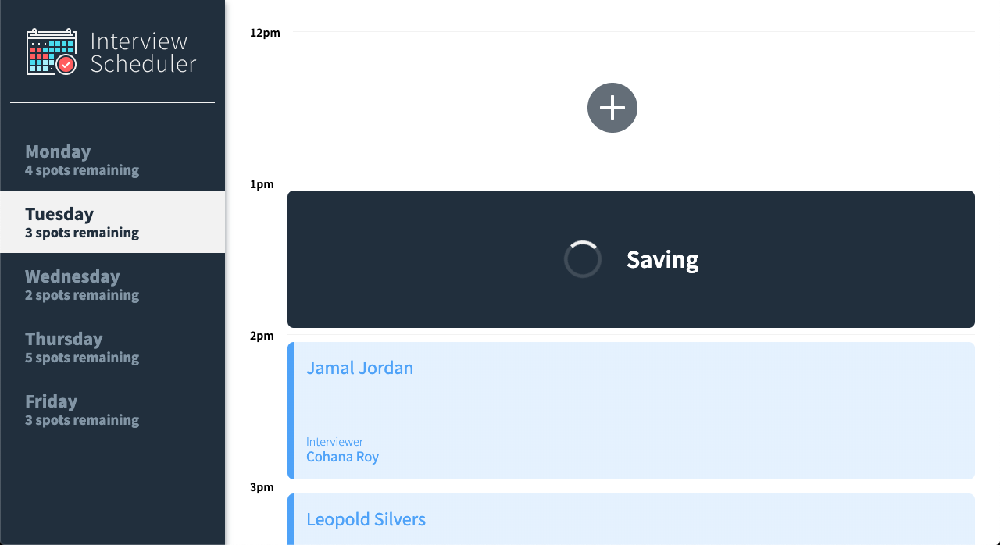
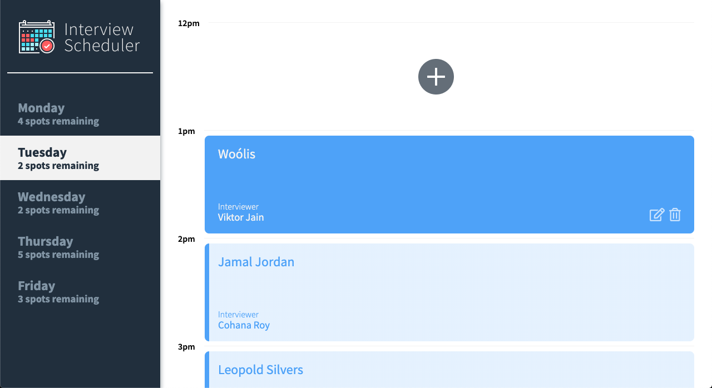
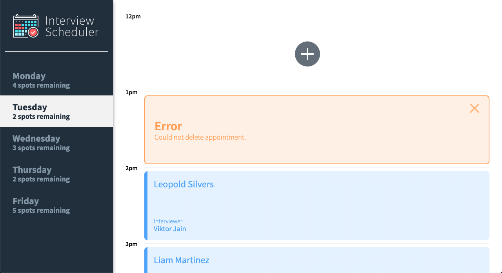

# Interview Scheduler

## Author

Jess N-L

## About

A dynamic one page schedule project using React's latest version with Hooks. See further details about Hooks [here](https://reactjs.org/docs/hooks-intro.html).


## User Experience

Interview Scheduler allows a user (student) to book a new interview by adding their name and selecting an interviewer on the fly. The user can also edit or remove an existing interview. The left-hand sidebar updates the amount of interview spots remaining in real time.

## Setup

Install dependencies with `npm install`.

## Running Webpack Development Server

```sh
npm start
```

## Running Jest Test Framework

```sh
npm test
```

## Running Storybook Visual Testbed

```sh
npm run storybook
```

## Screenshots

#### Book a new interview or edit an existing interview


#### Display status during the process of 'saving' or 'deleting' an interview


#### Display new interview once saved


#### Display error message when HTTP response is not successfully completed


## Dependencies

- Axios
- Classnames
- Normalize.css
- React
- React Dom
- React Scripts
- Babel
- Babel Loader
- Storybook
- Jest
- Node Sass
- Prop-types
- React Test Renderer